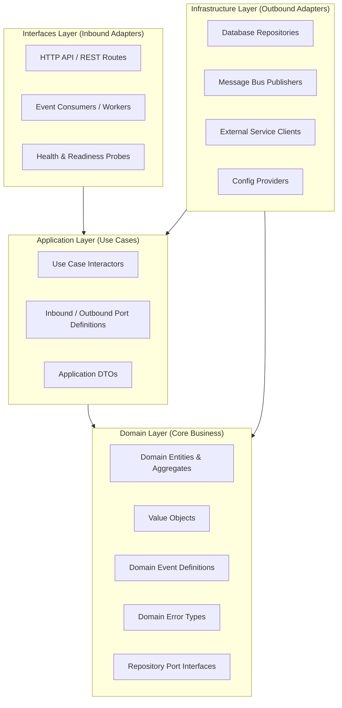

# OICUNT Platform Architecture

## 1. System Overview

The **OICUNT Platform** is designed as a distributed, high-reliability enterprise platform. It employs a modular monorepo architecture engineered for long-term scalability, strict operational boundaries, and rapid cross-service feature iteration without compromising maintainability.

This architecture balances independent service evolution with centralized, strictly governed foundational packages.

---

## 2. Core Architectural Principles

1. **Strict Boundary Isolation**:
   Domain business logic resides strictly within bounded contexts under `services/`. Foundational logic under `packages/` is domain-agnostic and serves as infrastructural glue or shared contracts.

2. **Clean / Hexagonal Architecture**:
   All services adhere to the Ports and Adapters pattern. The core domain and application logic remain completely isolated from infrastructure, transport protocols, and third-party frameworks.

3. **Contract-First Communication**:
   Inter-service interactions, data transfers, and external APIs are governed by type-safe contracts defined in `@oicunt/contracts` and canonical domain events defined in `@oicunt/events`.

4. **Deterministic Error Handling**:
   The platform prefers explicit Result types (`Result<T, E>`) over untyped exceptions for recoverable operational states, preserving call stack purity and predictable control flow.

5. **Zero-Trust Observability**:
   Every service boundary, message handler, and outbound request must carry traceable context (`correlationId`, `traceId`, `spanId`). No operations occur in unmeasured dark zones.

6. **Strict Static Typing**:
   TypeScript is configured in its strictest posture across all workspaces (`noImplicitAny`, `strictNullChecks`, `noUncheckedIndexedAccess`, `exactOptionalPropertyTypes`).

---

## 3. Monorepo Topology

```
platform/
├── .github/                 # Automation & CI/CD workflows
├── docs/                    # Architecture, design decisions, and operating runbooks
│   ├── architecture.md      # Platform & service architecture specifications
│   ├── contracts/           # Cross-service architectural contracts
│   │   ├── first-vertical-slice.md # First AI vertical slice specification
│   │   └── usage.md         # Usage & metering contract and migration path
│   ├── development.md       # Development setup & service scaffolding guide
│   └── contributing.md      # PR guidelines & conventional commit standards
├── infrastructure/          # Infrastructure as Code (IaC) and cloud manifests
│   ├── docker/              # Container build specifications
│   ├── helm/                # Service deployment charts
│   ├── kubernetes/          # Base K8s manifests & overlays
│   └── terraform/           # Cloud resource definitions
├── packages/                # Shared foundational libraries
│   ├── config/              # Environment schema & validation
│   ├── contracts/           # API response models & Result primitives
│   ├── events/              # Domain event specifications & bus contracts
│   ├── logging/             # Structured JSON logger abstractions
│   └── observability/       # Metrics, spans, and tracing contracts
├── services/                # Production microservices & worker daemons
├── templates/               # Reusable boilerplate and service blueprints
│   └── service/             # Canonical microservice starter template
├── tests/                   # End-to-end and system integration tests
└── scripts/                 # Platform operations & maintenance scripts
```

---

## 4. Shared Package Boundaries

The `packages/` directory defines the platform foundation. Dependencies flow strictly inwards towards packages, never from packages to services.


### 4.1 `@oicunt/config`

- **Responsibility**: Environment normalization (`development`, `staging`, `production`, `test`), runtime parameter validation, and foundational service configuration factories.
- **Rules**: Must remain pure; no external configuration server calls or network dependencies.

### 4.2 `@oicunt/contracts`

- **Responsibility**: Canonical HTTP status codes, standard JSON response wrappers (`ApiResponse<T>`, `ApiErrorResponse`, `PaginatedResponse<T>`), and the functional `Result<T, E>` monad.
- **Rules**: Zero runtime dependencies. Represents the ubiquitous data format for all platform endpoints.

### 4.3 `@oicunt/events`

- **Responsibility**: Common domain event structure (`DomainEvent<T>`), distributed metadata stamping (`eventId`, `correlationId`, `causationId`, `timestamp`, `producer`), and event bus interfaces (`EventPublisher`, `EventSubscriber`).
- **Rules**: Decoupled from transport mechanics (e.g. RabbitMQ, Kafka, SQS). Provides in-memory test doubles for deterministic unit testing.

### 4.4 `@oicunt/logging`

- **Responsibility**: Unified structured logging interface (`Logger`), severity ranking (`trace` through `fatal`), error serialization, and context propagation via child loggers.
- **Rules**: Guarantees zero crashing due to unhandled log formatting; includes `NoopLogger` and `MemoryLogger` for deterministic test verification.

### 4.5 `@oicunt/observability`

- **Responsibility**: Abstraction boundaries for distributed tracing (`Tracer`, `Span`, `SpanContext`) and metrics recording (`MetricsRecorder` with counter, gauge, and histogram).
- **Rules**: Decoupled from specific vendor SDKs. Includes non-interfering no-op implementations as safe defaults.

---

## 5. Microservice Architecture & Conventions

Every microservice introduced under `services/` must follow the standardized layered architecture defined herein.

### 5.1 Service Ownership & Bounded Contexts

1. **Autonomous Bounded Contexts**:
   Each service models a single bounded context according to Domain-Driven Design (DDD). Services own their domain rules, terminology, and invariants.
2. **Database-Per-Service Rule**:
   Services must never share a database, table, or persistent data store. All cross-boundary state access must occur via verified API contracts or published domain events.
3. **No Direct Code Sharing of Domain Models**:
   Services never share domain entities or internal data structures with other services. Integration happens solely through `@oicunt/contracts` DTOs or `@oicunt/events`.

---

### 5.2 Layered Architecture: Application, Domain, Infrastructure, Interfaces

All services strictly apply Hexagonal / Clean Architecture organized into four concentric layers:



#### Layer Breakdown

| Layer              | Path                  | Purpose & Responsibilities                                                                                                               | Permitted Dependencies                                                      | Forbidden Dependencies                                                     |
| ------------------ | --------------------- | ---------------------------------------------------------------------------------------------------------------------------------------- | --------------------------------------------------------------------------- | -------------------------------------------------------------------------- |
| **Domain**         | `src/domain/`         | Core entities, value objects, business invariants, domain events, domain errors, and repository port interfaces.                         | Pure TypeScript, `@oicunt/events`, `@oicunt/contracts`.                     | Any framework, HTTP, database, logging, or infrastructure libraries.       |
| **Application**    | `src/application/`    | Orchestrates domain models, coordinates transactions, defines use case commands/queries, input/output DTOs, and outbound port contracts. | `domain/`, `@oicunt/contracts`, `@oicunt/logging`, `@oicunt/observability`. | `infrastructure/`, `interfaces/`, concrete DB drivers, or HTTP frameworks. |
| **Infrastructure** | `src/infrastructure/` | Implements outbound ports (database repositories, message brokers, caching, HTTP client proxies, configuration loaders).                 | `application/`, `domain/`, `@oicunt/*`, external SDKs / drivers.            | `interfaces/`.                                                             |
| **Interfaces**     | `src/interfaces/`     | Inbound drivers (HTTP routes, controllers, middleware, event subscribers, health checks, CLI commands).                                  | `application/`, `domain/`, `@oicunt/*`.                                     | Direct DB queries or bypass of application use cases.                      |

#### Dependency Inversion Rules

- **The Inward Rule**: Outer layers (`interfaces`, `infrastructure`) depend on inner layers (`application`, `domain`). Inner layers never import from outer layers.
- **Ports & Adapters**: Application and Domain define _ports_ (interfaces). Infrastructure and Interfaces provide _adapters_ (implementations).
- **Wiring**: Dependencies are composed at the composition root (`src/index.ts` / `src/service.ts`) during service startup.

---

### 5.3 Canonical Service Directory Structure

```
services/<service-name>/
├── src/
│   ├── domain/               # Enterprise domain logic & port interfaces
│   │   ├── entities/         # Domain entities & aggregates
│   │   ├── events.ts         # Domain event definitions
│   │   ├── errors.ts         # Domain error definitions
│   │   ├── ports.ts          # Repository & outbound interface contracts
│   │   └── index.ts
│   ├── application/          # Use cases & application orchestration
│   │   ├── use-cases/        # Interactors / command & query handlers
│   │   ├── dtos.ts           # Input/output data transfer objects
│   │   ├── ports.ts          # Outbound service & notifier port interfaces
│   │   └── index.ts
│   ├── infrastructure/       # Outbound adapter implementations
│   │   ├── adapters/         # Port implementations (repositories, publishers)
│   │   ├── config.ts         # Service configuration loading via @oicunt/config
│   │   └── index.ts
│   ├── interfaces/           # Inbound adapters (HTTP, Event Listeners)
│   │   ├── http/             # REST endpoints, routes, controllers
│   │   │   ├── health.ts     # /healthz and /readyz probes
│   │   │   ├── middleware.ts # Correlation, logging, error middleware
│   │   │   └── routes.ts     # Route definitions
│   │   └── index.ts
│   ├── service.ts            # Service lifecycle management (start, stop, health)
│   └── index.ts              # Entry point & composition root
├── tests/
│   ├── unit/                 # Domain & use case tests (in-memory, no I/O)
│   ├── integration/          # Adapter & repository tests
│   └── e2e/                  # End-to-end HTTP API tests
├── package.json              # Service package definition
├── tsconfig.json             # Service TypeScript configuration
└── README.md                 # Service documentation
```

---

### 5.4 HTTP API Conventions

All platform HTTP services adhere to standard RESTful design guidelines:

1. **Resource URI Naming**:
   - Use kebab-case for multi-word paths: `/api/v1/user-profiles`
   - Use plural nouns for resource collections: `/api/v1/projects`
   - Use explicit path versioning: `/api/v1/...`
2. **Standard Response Envelopes**:
   Every JSON response must utilize the envelope models from `@oicunt/contracts`:
   - **Success Single**: `ApiResponse<T>` (`{ success: true, data: T, meta?: ResponseMetadata }`)
   - **Success Paginated**: `PaginatedResponse<T>` (`{ success: true, data: T[], pagination: PaginationMeta, meta?: ResponseMetadata }`)
   - **Error**: `ApiErrorResponse` (`{ success: false, error: { code: string, message: string, details?: ApiErrorDetail[] }, meta?: ResponseMetadata }`)
3. **HTTP Status Codes**:
   Always reference `HttpStatus` constants from `@oicunt/contracts`:
   - `200 OK`: Successful read or idempotent mutation.
   - `201 CREATED`: Successful resource creation.
   - `204 NO CONTENT`: Successful action yielding no payload.
   - `400 BAD REQUEST`: Invalid client input or malformed payload.
   - `401 UNAUTHORIZED`: Authentication required or token invalid.
   - `403 FORBIDDEN`: Caller lacks permissions for the resource.
   - `404 NOT FOUND`: Target resource does not exist.
   - `409 CONFLICT`: State collision (e.g., unique key violation).
   - `422 UNPROCESSABLE ENTITY`: Semantic validation failure.
   - `500 INTERNAL SERVER ERROR`: Unhandled operational defect.
   - `503 SERVICE UNAVAILABLE`: Service booting or downstream unavailable.
4. **Mandatory Headers**:
   - `X-Correlation-ID`: Incoming correlation identifier or newly generated UUID, returned in response headers and injected into log contexts.
   - `Content-Type`: `application/json; charset=utf-8`

---

### 5.5 Configuration Conventions

1. **Validation at Startup**:
   Services must define an explicit configuration schema extending `BaseServiceConfig` from `@oicunt/config`.
2. **Fail-Fast Boot**:
   If any required environment variable is missing, malformed, or out of acceptable bounds, the service process must terminate immediately with exit code 1 and a descriptive fatal log.
3. **Immutability & Injection**:
   Configuration objects are frozen upon validation and injected into infrastructure adapters via dependency injection. No component may read `process.env` directly outside the configuration adapter.

---

### 5.6 Error Handling Strategy

1. **Functional Result Pattern**:
   Domain and application use cases return `Result<T, E>` (`ok(value)` or `err(error)`) from `@oicunt/contracts` for expected business failures (e.g., entity not found, validation error, invariant broken).
2. **Typed Error Hierarchies**:
   Services define explicit domain error classes:
   ```typescript
   export class DomainError extends Error {
     constructor(
       public readonly code: string,
       message: string,
     ) {
       super(message);
       this.name = 'DomainError';
     }
   }
   ```
3. **Boundary Translation**:
   The HTTP interface layer catches errors and maps domain failures to appropriate HTTP status codes and `ApiErrorResponse` envelopes.
4. **Information Leakage Prevention**:
   In production environments, internal database error details and stack traces must never be exposed in `ApiErrorResponse`. Stack traces are strictly captured in server-side logs.

---

### 5.7 Structured Logging Standards

1. **Structured JSON**:
   All log output uses `@oicunt/logging`. Output must be machine-parseable JSON lines in production.
2. **Mandatory Fields**:
   Every log entry includes:
   - `timestamp` (ISO-8601)
   - `level` (`trace` | `debug` | `info` | `warn` | `error` | `fatal`)
   - `message` (human-readable summary)
   - `service` (service name)
   - `correlationId` (distributed request trace)
3. **Contextual Child Loggers**:
   Create a scoped child logger per request: `logger.child({ correlationId, route: req.url })`.
4. **PII & Credential Scrubbing**:
   Passwords, API keys, tokens, and personally identifiable information must be redacted before logging.

---

### 5.8 Observability & Distributed Tracing

1. **Distributed Tracing**:
   Incoming HTTP requests parse W3C `traceparent` or generate a new trace context using `@oicunt/observability`.
2. **Metric Instrumentation**:
   Services record standard RED metrics using `MetricsRecorder`:
   - **Rate**: Request throughput (`http_requests_total`)
   - **Errors**: Failure count (`http_errors_total` by status code)
   - **Duration**: Latency histogram (`http_request_duration_ms`)
3. **Trace Propagation**:
   When invoking external services or publishing domain events, trace context (`traceId`, `spanId`, `correlationId`) must be forwarded in transport headers or event metadata.

---

### 5.9 Health & Readiness Probes

Every service must expose two standard probe endpoints:

1. **Liveness Probe (`/healthz` or `/health/liveness`)**:
   - **Purpose**: Verifies that the Node.js event loop is running and responsive.
   - **Response**: `200 OK` with `{ success: true, data: { status: 'alive' } }`.
   - **K8s Action**: Failure causes Kubernetes to restart the container pod.
2. **Readiness Probe (`/readyz` or `/health/readiness`)**:
   - **Purpose**: Verifies that the service has initialized its connections and is ready to process client traffic.
   - **Response**: `200 OK` when ready, or `503 SERVICE UNAVAILABLE` during initialization or downstream failure.
   - **K8s Action**: Failure temporarily removes the pod from the load balancer pool without restarting it.

---

### 5.10 Service-to-Service Communication

1. **Asynchronous (Default)**:
   Inter-service communication defaults to event-driven choreography via `@oicunt/events`. Services emit domain events when state changes occur and react asynchronously to foreign events.
2. **Synchronous (RPC/HTTP)**:
   When immediate read consistency or request-reply semantics are required:
   - Must use typed client SDKs or explicit `@oicunt/contracts` models.
   - Must set explicit connection and read timeouts (default: 3000ms).
   - Must propagate `X-Correlation-ID`.
   - Must implement exponential backoff retries with jitter for idempotent operations.

---

### 5.11 Event Publishing & Consuming

1. **Event Schema**:
   All events inherit from `DomainEvent<T>` from `@oicunt/events` with complete `EventMetadata`:
   ```typescript
   export interface EventMetadata {
     readonly eventId: string;
     readonly correlationId: string;
     readonly causationId?: string;
     readonly timestamp: string;
     readonly version: string;
     readonly producer: string;
   }
   ```
2. **Consumer Idempotency**:
   Message delivery in distributed systems is at-least-once. All event consumers must be designed to be idempotent by checking and recording processed `eventId` keys.
3. **Schema Evolution**:
   Events must remain backward-compatible. Fields may only be added as optional. Breaking changes require a new major event version (e.g. `order.created.v2`).

---

### 5.12 Testing Conventions & Quality Gates

Each service maintains three tiers of testing:

1. **Unit Tests (`tests/unit/`)**:
   - Target: `domain/` and `application/` layers.
   - Execution: Pure in-memory execution; no network, disk, or DB I/O.
   - Speed: Milliseconds per test file.
2. **Integration Tests (`tests/integration/`)**:
   - Target: `infrastructure/` adapters and repository implementations.
   - Execution: Uses test doubles or containerized infrastructure.
3. **End-to-End Tests (`tests/e2e/`)**:
   - Target: HTTP API endpoints and middleware pipelines.
   - Verification: Endpoints return valid `@oicunt/contracts` response envelopes and correct status codes.

---

## 6. Infrastructure & Deployment Strategy

Infrastructure manifests are decoupled from application source code:

- **`infrastructure/docker/`**: Base and service Dockerfile templates using multi-stage builds.
- **`infrastructure/terraform/`**: Cloud infrastructure provisioning using remote state and modular components.
- **`infrastructure/kubernetes/` & `infrastructure/helm/`**: Declarative workload orchestrations, ingress definitions, network policies, and horizontal autoscaling configurations.

---

## 7. Continuous Integration Quality Gates

Every code change must satisfy all automated quality gates before integration:

1. **Installation Integrity**: Fast, deterministic lockfile resolution via `pnpm install --frozen-lockfile`.
2. **Format Conformity**: Complete adherence to Prettier formatting across code and documentation.
3. **Static Analysis & Linting**: ESLint flat config with TypeScript rules and zero tolerated warnings/errors.
4. **Type Soundness**: Full TypeScript build validation with project references (`tsc -b`).
5. **Automated Testing**: Complete test suite execution across all workspace packages via Vitest.

---

## 8. Platform Usage & Metering Subsystem

The **Usage & Metering Subsystem** (`@oicunt/service-usage` located in `services/usage/`) is the central, authoritative system of record for tracking resource consumption across all OICUNT business verticals and platform components.

### 8.1 System Boundaries & Ownership Separation

- **Platform Ownership**:
  - Authoritative metering system of record.
  - Durable, immutable append-only event log (`oicunt_usage.usage_events`).
  - Strict tenant isolation and scoped deduplication (`uq_usage_events_tenant_idempotency`).
  - Pre-computed hourly and daily rollups (`usage_aggregates_hourly`, `usage_aggregates_daily`).
  - Compensating adjustments and reversals.
  - Authoritative query surface for internal dashboards, quotas, and future billing/invoicing engines.

- **AI Platform (`ai-platform`) Ownership**:
  - Event producer only.
  - Measures AI-specific execution units (`tokens.input`, `tokens.output`, `tokens.reasoning`, `tokens.cached_input`, `vectors.dimensions`, `tool.calls`, `agent.steps`, `duration.ms`).
  - Emits normalized `UsageEvent` payloads to the Platform Usage AMQP topic exchange (`oicunt.usage.exchange`) or synchronous HTTP ingestion API.
  - Explicitly prohibited from acting as a company-wide meter or storing billing-authoritative records.

### 8.2 Ingestion & Persistence Model

1. **Generalized Canonical Contract**:
   Events adhere to `UsageEvent` from `@oicunt/contracts`. Measurement numbers are stored in `measurements` (with arbitrary custom metric support), qualitative groupings in `dimensions`, and tracing provenance in `lineage`.
2. **Append-Only Immutability**:
   Events are immutable. Postgres trigger constraints (`trg_prevent_usage_events_mutation`) reject any `UPDATE` or `DELETE` statements on the raw event table.
3. **Idempotency Guarantee**:
   Deduplication is enforced per `(tenant_id, idempotency_key)`. Duplicate deliveries are safely accepted and flagged as duplicates without altering state.
4. **Reversal Model**:
   Corrections, voids, or SLA credits are recorded as new usage events with negative measurement values referencing the original event via `lineage.reversalOf`.

For complete API specifications and migration procedures, refer to [Usage Architecture Contract](contracts/usage.md).
