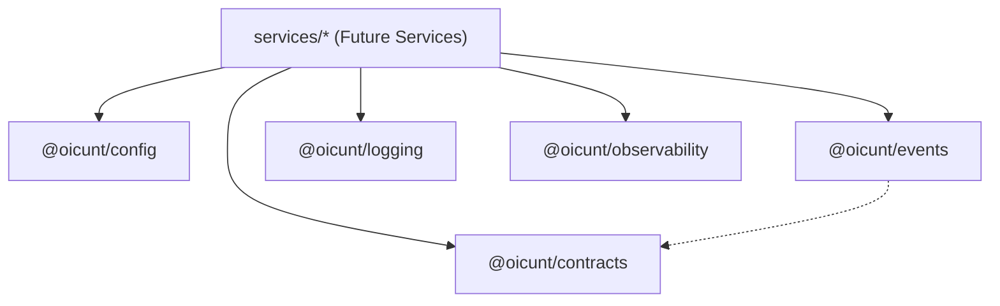

# OICUNT Platform Architecture

## 1. System Overview

The **OICUNT Platform** is designed as a distributed, high-reliability enterprise platform. It employs a modular monorepo architecture engineered for long-term scalability, strict operational boundaries, and rapid cross-service feature iteration without compromising maintainability.

This architecture balances independent service evolution with centralized, strictly governed foundational packages.

---

## 2. Core Architectural Principles

1. **Strict Boundary Isolation**:
   Domain business logic resides strictly within bounded contexts under `services/`. Foundational logic under `packages/` is domain-agnostic and serves as infrastructural glue or shared contracts.

2. **Contract-First Communication**:
   Inter-service interactions, data transfers, and external APIs are governed by type-safe contracts defined in `@oicunt/contracts` and canonical domain events defined in `@oicunt/events`.

3. **Deterministic Error Handling**:
   The platform prefers explicit Result types (`Result<T, E>`) over untyped exceptions for recoverable operational states, preserving call stack purity and predictable control flow.

4. **Zero-Trust Observability**:
   Every service boundary, message handler, and outbound request must carry traceable context (`correlationId`, `traceId`, `spanId`). No operations occur in unmeasured dark zones.

5. **Strict Static Typing**:
   TypeScript is configured in its strictest posture across all workspaces (`noImplicitAny`, `strictNullChecks`, `noUncheckedIndexedAccess`, `exactOptionalPropertyTypes`).

---

## 3. Monorepo Topology

```
platform/
├── .github/                 # Automation & CI/CD workflows
├── docs/                    # Architecture, design decisions, and operating runbooks
├── infrastructure/          # Infrastructure as Code (IaC) and cloud manifests
│   ├── docker/              # Container build specifications
│   ├── helm/                # Service deployment charts
│   ├── kubernetes/          # Base K8s manifests & overlays
│   └── terraform/           # Cloud resource definitions
├── packages/                # Shared foundational libraries
│   ├── config/              # Environment schema & validation
│   ├── contracts/           # API response models & Result primitives
│   ├── events/              # Domain event specifications & bus contracts
│   ├── logging/             # Structured JSON logger abstractions
│   └── observability/       # Metrics, spans, and tracing contracts
├── services/                # Backend microservices & worker daemons
├── tests/                   # End-to-end and system integration tests
└── scripts/                 # Platform operations & maintenance scripts
```

---

## 4. Shared Package Boundaries

The `packages/` directory defines the platform foundation. Dependencies flow strictly inwards towards packages, never from packages to services.



### 4.1 `@oicunt/config`

- **Responsibility**: Environment normalization (`development`, `staging`, `production`, `test`), runtime parameter validation, and foundational service configuration factories.
- **Rules**: Must remain pure; no external configuration server calls or network dependencies.

### 4.2 `@oicunt/contracts`

- **Responsibility**: Canonical HTTP status codes, standard JSON response wrappers (`ApiResponse<T>`, `ApiErrorResponse`, `PaginatedResponse<T>`), and the functional `Result<T, E>` monad.
- **Rules**: Zero runtime dependencies. Represents the ubiquitous data format for all platform endpoints.

### 4.3 `@oicunt/events`

- **Responsibility**: Common domain event structure (`DomainEvent<T>`), distributed metadata stamping (`eventId`, `correlationId`, `causationId`, `timestamp`, `producer`), and event bus interfaces (`EventPublisher`, `EventSubscriber`).
- **Rules**: Decoupled from transport mechanics (e.g. RabbitMQ, Kafka, SQS). Provides in-memory test doubles for deterministic unit testing.

### 4.4 `@oicunt/logging`

- **Responsibility**: Unified structured logging interface (`Logger`), severity ranking (`trace` through `fatal`), error serialization, and context propagation via child loggers.
- **Rules**: Guarantees zero crashing due to unhandled log formatting; includes `NoopLogger` and `MemoryLogger` for deterministic test verification.

### 4.5 `@oicunt/observability`

- **Responsibility**: Abstraction boundaries for distributed tracing (`Tracer`, `Span`, `SpanContext`) and metrics recording (`MetricsRecorder` with counter, gauge, and histogram).
- **Rules**: Decoupled from specific vendor SDKs. Includes non-interfering no-op implementations as safe defaults.

---

## 5. Future Service Boundaries

Services under `services/` will adhere to the following standards:

1. **Independent Lifecycle**: Each service must declare its own `package.json`, build targets, Docker container definitions, and unit test suites.
2. **Explicit Dependency Inversion**: Infrastructure dependencies (database clients, messaging clients, third-party APIs) are injected via interfaces rather than tightly coupled singletons.
3. **No Direct Service-to-Service Database Access**: Each service owns its bounded data store. Cross-service data synchronization occurs strictly through published domain events or verified API contracts.

---

## 6. Infrastructure & Deployment Strategy

Infrastructure manifests are decoupled from application source code:

- **`infrastructure/docker/`**: Base and service Dockerfile templates using multi-stage builds.
- **`infrastructure/terraform/`**: Cloud infrastructure provisioning using remote state and modular components.
- **`infrastructure/kubernetes/` & `infrastructure/helm/`**: Declarative workload orchestrations, ingress definitions, network policies, and horizontal autoscaling configurations.

---

## 7. Continuous Integration Quality Gates

Every code change must satisfy all automated quality gates before integration:

1. **Installation Integrity**: Fast, deterministic lockfile resolution via `pnpm install --frozen-lockfile`.
2. **Format Conformity**: Complete adherence to Prettier formatting across code and documentation.
3. **Static Analysis & Linting**: ESLint flat config with TypeScript rules and zero tolerated warnings/errors.
4. **Type Soundness**: Full TypeScript build validation with project references (`tsc -b`).
5. **Automated Testing**: Complete test suite execution across all workspace packages via Vitest.
