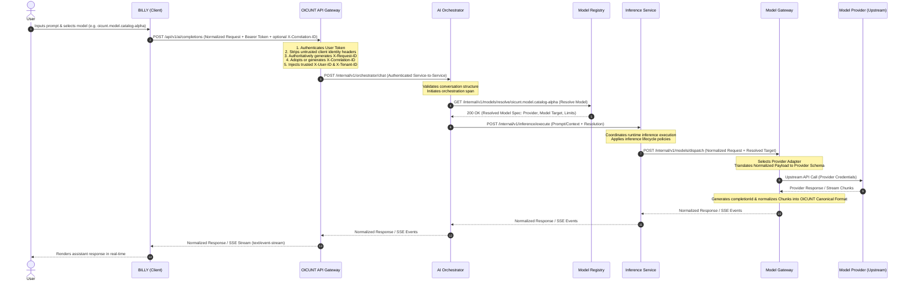
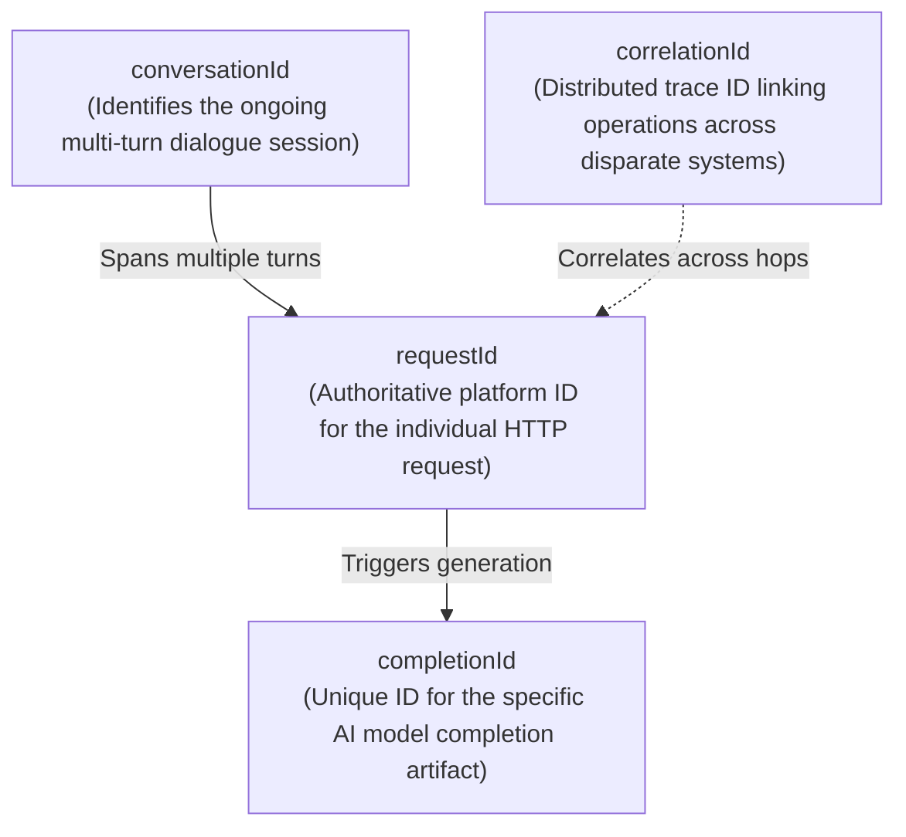
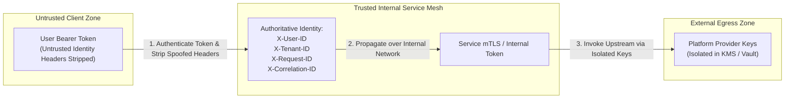

# OICUNT Platform: First AI Vertical Slice Architecture Contract

**Document Version**: 1.1.0  
**Status**: Approved Specification  
**Classification**: Engineering Architecture Standard

---

## 1. Executive Summary & System Context

This document establishes the formal, binding architectural contract for the first AI vertical slice of the **OICUNT Platform**. It defines the end-to-end request lifecycle, wire contracts, streaming protocols, identity boundaries, error handling standards, and component responsibilities for AI completions.

### 1.1 End-to-End Request Flow

The canonical request path flows sequentially across six distinct architectural boundaries:

```
┌─────────┐      ┌─────────────┐      ┌─────────────────┐
│  BILLY  │ ───► │ API Gateway │ ───► │ AI Orchestrator │
└─────────┘      └─────────────┘      └────────┬────────┘
                                               │
                       ┌───────────────────────┴───────────────────────┐
                       │ (Control Plane)                               │ (Runtime Execution)
                       ▼                                               ▼
            ┌────────────────────┐                          ┌────────────────────┐
            │   Model Registry   │                          │ Inference Service  │
            └────────────────────┘                          └──────────┬─────────┘
                                                                       │
                                                                       ▼
                                                            ┌────────────────────┐
                                                            │   Model Gateway    │
                                                            └──────────┬─────────┘
                                                                       │ (Provider Adapter)
                                                                       ▼
                                                            ┌────────────────────┐
                                                            │   Model Provider   │
                                                            └────────────────────┘
```



---

## 2. Architectural Invariants

Every service and engineer working on the OICUNT AI platform must strictly enforce the following invariants:

1. **BILLY never calls an LLM provider directly**: BILLY only communicates with the OICUNT API Gateway over authenticated, normalized platform endpoints.
2. **Provider-specific APIs never leak into BILLY**: BILLY has zero knowledge of upstream provider parameter names, response schemas, error codes, or SDKs.
3. **Provider-specific APIs never leak into the AI Orchestrator**: The Orchestrator operates exclusively on OICUNT normalized conversation contracts and canonical model identifiers.
4. **Model selection uses OICUNT-owned canonical identifiers**: Public requests specify identifiers such as `oicunt.model.catalog-alpha`, never provider-specific model IDs such as `provider-model-alpha` or `provider-model-beta`.
5. **Model responses are normalized**: Synchronous responses conform strictly to the platform's `ApiResponse<NormalizedCompletionData>` envelope.
6. **Streaming responses are normalized**: Streaming responses use Server-Sent Events (SSE) with strictly defined, typed OICUNT event names and payloads.
7. **Errors are normalized**: Provider rate limits, context window overages, and timeouts are mapped to standard platform error codes wrapped in `ApiErrorResponse`.
8. **Every request carries authoritative request and correlation information**:
   - The API Gateway generates an authoritative, platform-owned `requestId` for every request.
   - Clients may provide an optional `correlationId` to track cross-system workflows, but client-supplied request IDs are never trusted as authoritative.
9. **User identity headers are strictly authoritative and internal**:
   - `X-User-ID` and `X-Tenant-ID` are trusted internal metadata established solely by the API Gateway after token authentication.
   - The API Gateway unconditionally strips/ignores any client-supplied `X-User-ID` and `X-Tenant-ID` headers to prevent identity spoofing.
   - Downstream services must never trust identity headers received directly from an untrusted client.
10. **User identity and service identity are strictly separated**: User credentials terminate at the API Gateway; service workloads authenticate with internal service identities (mTLS / internal tokens); provider credentials reside solely within the Model Gateway.

---

## 3. Component Responsibilities & Boundaries

```mermaid
graph TD
    subgraph ClientLayer["Client Layer (Untrusted Perimeter)"]
        BILLY["BILLY Client<br/>(Web / Desktop / Mobile)"]
    end

    subgraph PerimeterLayer["Perimeter Layer (Security & Ingress)"]
        APIGW["OICUNT API Gateway<br/>(Ingress & Authoritative Auth)"]
    end

    subgraph ControlPlane["Control Plane (Catalog & Resolution)"]
        Reg["Model Registry<br/>(Model Catalog & Routing Spec)"]
    end

    subgraph OrchestrationLayer["Internal Service Mesh (Trusted)"]
        Orch["AI Orchestrator<br/>(Turn & Workflow Engine)"]
        Inf["Inference Service<br/>(Runtime Inference Coordination)"]
    end

    subgraph GatewayLayer["Egress Gateway Layer (Trusted)"]
        MGW["Model Gateway<br/>(Normalization & Resilience)"]
        Adapter["Provider Adapters<br/>(Internal Gateway Modules)"]
    end

    subgraph ExternalLayer["External Layer"]
        Provider["Configured Upstream Model Providers"]
    end

    BILLY -->|HTTPS / SSE (Bearer Token)| APIGW
    APIGW -->|Internal HTTP / Service Auth| Orch
    Orch -->|Internal HTTP (Control Plane)| Reg
    Orch -->|Internal HTTP / Service Auth| Inf
    Inf -->|Internal HTTP / Service Auth| MGW
    MGW --> Adapter
    Adapter -->|HTTPS Egress (Platform Vault Keys)| Provider
```

### 3.1 BILLY (Client Application)

- **Role**: User-facing conversational client application.
- **Responsibilities**:
  - Accepts user prompt input and maintains local client-side presentation state.
  - Allows the user to select an individual model returned by the public catalog using its stable OICUNT-owned ID.
  - Supplies conversation identity (`conversationId`) to track multi-turn dialogues.
  - Sends normalized completion requests to the OICUNT API Gateway with user Bearer tokens.
  - May provide an optional client-side `X-Correlation-ID` header.
  - Consumes and renders normalized Server-Sent Events (`stream.start`, `stream.delta`, `stream.done`, `stream.error`).
  - Handles client-side reconnection and error presentation.
- **Forbidden**:
  - Never stores or transmits external LLM provider API keys.
  - Never supplies or asserts identity headers (`X-User-ID`, `X-Tenant-ID`); any such headers sent by BILLY will be stripped at the gateway.
  - Never references provider-specific model names, parameters, or schemas.
  - Never makes direct network calls to upstream model providers.

### 3.2 OICUNT API Gateway

- **Role**: Perimeter ingress controller, identity authorizer, and security policy enforcement point.
- **Responsibilities**:
  - Terminates external TLS and handles perimeter request routing.
  - **Authoritative Identity Establishment**:
    - Authenticates the incoming user session credentials (e.g. Bearer JWT).
    - Unconditionally **strips/ignores** any incoming client-supplied `X-User-ID`, `X-Tenant-ID`, and `X-Roles` headers to prevent identity spoofing.
    - Decodes and verifies the identity context from the authenticated token claims.
    - Authoritatively injects trusted `X-User-ID` and `X-Tenant-ID` headers into downstream internal requests.
  - **Authoritative ID Generation**:
    - Establishes the authoritative `X-Request-ID` (UUID v4) for the request hop. Rejects/overwrites any untrusted client-supplied request ID.
    - Evaluates incoming `X-Correlation-ID`: adopts it if provided as a valid string, or generates a new UUID v4 if missing.
  - Enforces ingress rate limiting and payload validation.
  - Proxies normalized unary responses and streams SSE frames without buffering or modifying payloads.
  - Signs internal service-to-service authentication tokens (`X-Internal-Service-Token` or Bearer) for downstream propagation.
- **Forbidden**:
  - Never trusts client-supplied identity headers or client-asserted request IDs.
  - Never executes AI orchestration logic or prompt mutation.
  - Never interfaces directly with LLM providers.

### 3.3 AI Orchestrator

- **Role**: Domain orchestrator for conversational AI workflows.
- **Responsibilities**:
  - Validates conversation integrity, message sequencing, and role validity (`system`, `user`, `assistant`).
  - Correlates dialogue history using `conversationId`.
  - Consumes trusted `X-User-ID` and `X-Tenant-ID` provided by the API Gateway over authenticated service-to-service communication.
  - Queries the Model Registry control-plane to resolve canonical model capabilities, target configurations, and parameter bounds.
  - Applies platform-level prompt guardrails and policy constraints.
  - Dispatches runtime execution requests to the Inference Service with internal service authentication.
  - Coordinates streaming lifecycle from the Inference Service back to the API Gateway.
- **Forbidden**:
  - Contains **zero** provider-specific SDKs, API calls, or payload formatting code.
  - Never accepts requests directly from untrusted clients bypassing the API Gateway.
  - Never reads or holds external provider API keys or credentials.
  - Never interacts directly with third-party model provider endpoints.

### 3.4 Inference Service

- **Role**: Runtime inference execution and streaming coordination service.
- **Responsibilities**:
  - Receives normalized conversation context and model resolution specifications from the AI Orchestrator.
  - Coordinates runtime inference execution lifecycle and streaming chunk delivery.
  - Dispatches execution requests to the Model Gateway using internal service authentication.
  - Normalizes and streams chunks/completions back to the AI Orchestrator.
- **Forbidden**:
  - Never performs model catalog resolution or pricing lookup (owned by Model Registry).
  - Never interacts directly with third-party model provider endpoints or manages vendor credentials (owned by Model Gateway).

### 3.5 Model Registry

- **Role**: Authoritative catalog and routing directory for AI models (Control Plane).
- **Responsibilities**:
  - Maintains the authoritative registry of individual OICUNT model identifiers in the `oicunt.model.<catalog-slug>` namespace.
  - Resolves canonical identifiers to concrete provider targets, including provider name, upstream model ID, context window limits, and parameter constraints.
  - Manages deployment routing policies (active routing, canary routing, fallbacks, blue-green migrations).
  - Exposes an internal query API for dynamic catalog discovery and model resolution.
- **Forbidden**:
  - Never handles user inference traffic or payload data.
  - Never initiates outbound connections to model providers.
  - Never stores or reads provider API credentials.

### 3.6 Model Gateway

- **Role**: Egress gateway, payload normalizer, and resilience barrier for LLM providers.
- **Responsibilities**:
  - Receives normalized AI requests and resolved model target specifications exclusively from the Inference Service.
  - Generates the authoritative `completionId` for the generation attempt.
  - Selects and invokes the appropriate Provider Adapter.
  - Manages secure provider credential storage and retrieval via platform secret managers.
  - Normalizes provider responses and SSE chunks into OICUNT canonical format.
  - Normalizes provider-specific errors into standard OICUNT platform error codes.
  - Implements egress resilience patterns: circuit breaking, exponential backoff retries with jitter, and request timeouts.
- **Forbidden**:
  - Does not maintain user conversation history or session state.
  - Does not leak provider-specific data structures past its boundary.

### 3.7 Provider Adapters

- **Role**: Low-level vendor translation plugins encapsulated entirely within the Model Gateway (anti-corruption layer; not independent microservices).
- **Responsibilities**:
  - Translates OICUNT normalized requests into the selected provider's private wire format.
  - Translates vendor-specific streaming chunks into normalized OICUNT stream events.
  - Maps vendor-specific HTTP error codes and exception payloads into normalized gateway errors.
- **Forbidden**:
  - Never exposed outside the Model Gateway process boundary.
  - Never accessed directly by BILLY, API Gateway, or the AI Orchestrator.

---

## 4. Identifier Architecture & Correlation Contract

The OICUNT platform clearly separates four distinct categories of identifiers across every request lifecycle:



### 4.1 Definitive Identifier Taxonomy

| Identifier           | Scope                    | Established By                         | Mutability | Purpose & Semantics                                                                                                                                                                             |
| -------------------- | ------------------------ | -------------------------------------- | ---------- | ----------------------------------------------------------------------------------------------------------------------------------------------------------------------------------------------- |
| **`requestId`**      | Single HTTP Request      | **OICUNT API Gateway** (Authoritative) | Immutable  | Authoritative platform-generated identifier (UUID v4) for the discrete incoming request. Generated at the gateway ingress. **The platform must not blindly trust a client-provided requestId.** |
| **`correlationId`**  | Cross-System Lifecycle   | **Client (Optional) or API Gateway**   | Immutable  | Distributed trace identifier used to correlate related operations across systems, service logs, async jobs, and audit events. Client may supply; API Gateway adopts or generates.               |
| **`conversationId`** | Conversational Session   | **BILLY / User Client**                | Stable     | Identifies the conversational dialogue session across multiple message turns. Retained across sequential user prompts.                                                                          |
| **`completionId`**   | Individual AI Generation | **Model Gateway**                      | Immutable  | Canonical identifier for the specific AI completion generated by the underlying model provider (e.g. `cmpl_01J9X4T7M2KV8NRQ9PZ1W4D7FE`).                                                        |

### 4.2 Standard HTTP Headers

| Header Name        | Type             | Ingress Trust Policy                                                                       | Downstream Propagation                                    | Description                                                |
| ------------------ | ---------------- | ------------------------------------------------------------------------------------------ | --------------------------------------------------------- | ---------------------------------------------------------- |
| `X-Request-ID`     | UUID v4          | **Untrusted from Client**. API Gateway strips client value and generates authoritative ID. | Injected by API Gateway into all downstream hops.         | Authoritative platform request identifier.                 |
| `X-Correlation-ID` | UUID v4 / string | **Conditionally Trusted**. Adopted if provided by client; generated if absent.             | Propagated unchanged across all downstream hops and logs. | End-to-end distributed transaction correlation identifier. |
| `X-User-ID`        | String           | **Untrusted from Client**. Stripped on ingress; populated from verified auth token.        | Injected by API Gateway into trusted service network.     | Authoritative verified user identity.                      |
| `X-Tenant-ID`      | String           | **Untrusted from Client**. Stripped on ingress; populated from verified auth token.        | Injected by API Gateway into trusted service network.     | Authoritative verified tenant / organization identity.     |

---

## 5. Identity & Security Boundaries



### 5.1 Trusted Identity Headers Contract

1. **Perimeter Authentication**:
   - The API Gateway authenticates the client's bearer token against the identity provider.
   - Any client-submitted `X-User-ID`, `X-Tenant-ID`, or `X-Roles` headers are stripped immediately upon entry.
   - The API Gateway populates `X-User-ID` and `X-Tenant-ID` strictly from the cryptographically verified token claims.
2. **Internal Downstream Trust Rule**:
   - Downstream services (AI Orchestrator, Model Registry, Model Gateway) **must never trust identity headers received directly from an untrusted client or external network**.
   - Identity headers are trusted downstream **only** when received over authenticated internal service-to-service connections (mTLS or verified internal service mesh tokens) from the API Gateway.
3. **Provider Key Isolation**:
   - Platform-owned enterprise LLM API keys and service credentials reside exclusively in secure vaults managed by the Model Gateway.
   - User identity credentials are never forwarded to external model providers.
   - Provider keys are completely inaccessible to BILLY, API Gateway, and AI Orchestrator.

---

## 6. Model Selection & Canonical Identifiers

### 6.1 Canonical Naming Convention

All public-facing model selections and orchestration contracts use **OICUNT Canonical Model Identifiers**. Provider-specific model strings (e.g. `provider-model-beta-2024-08-06`, `provider-model-alpha-v1`) are strictly internal implementation details of the Model Registry and Model Gateway.

```
oicunt.model.<capability-tier>
```

### 6.2 Standard Platform Model Identifiers

| Canonical Identifier         | Capability Tier               | Primary Use Case                                           | Target Characteristics                                  |
| ---------------------------- | ----------------------------- | ---------------------------------------------------------- | ------------------------------------------------------- |
| `oicunt.model.catalog-alpha` | Catalog Model Alpha           | Example individual catalog entry                           | Capabilities are supplied dynamically by Model Registry |
| `oicunt.model.catalog-gamma` | Deep Reasoning & Logic        | Code generation, complex deduction, multi-step math        | Extended thinking, deep step-by-step reasoning          |
| `oicunt.model.catalog-beta`  | Low Latency / High Throughput | Quick queries, classifications, summaries, autocompletions | Sub-second first-token latency, lightweight compute     |

### 6.3 Model Resolution Contract

The Model Registry returns a resolved target specification to the Orchestrator/Gateway:

```typescript
export interface ModelResolutionTarget {
  readonly canonicalId: string;
  readonly provider: 'test-provider' | 'openai' | 'google' | 'bedrock';
  readonly upstreamModelId: string;
  readonly contextWindow: {
    readonly maxInputTokens: number;
    readonly maxOutputTokens: number;
  };
  readonly supportedFeatures: {
    readonly streaming: boolean;
    readonly functionCalling: boolean;
  };
  readonly defaultParameters: {
    readonly temperature: number;
    readonly topP: number;
  };
}
```

---

## 7. Normalized AI Request Contract

**Endpoint**: `POST /api/v1/ai/completions`  
**Protocol**: HTTP/1.1 or HTTP/2 over TLS  
**Content-Type**: `application/json; charset=utf-8`

### 7.1 Request TypeScript Interfaces

```typescript
export type MessageRole = 'system' | 'user' | 'assistant';

export interface ChatMessage {
  readonly role: MessageRole;
  readonly content: string;
}

export interface ModelParameters {
  readonly temperature?: number; // Range: [0.0, 2.0], default: 0.7
  readonly topP?: number; // Range: [0.0, 1.0], default: 1.0
  readonly maxTokens?: number; // Upper bound on generated tokens
  readonly stopSequences?: readonly string[]; // Strings that halt generation
}

export interface NormalizedAiRequest {
  readonly conversationId: string; // Identifies the ongoing conversation/session
  readonly model: string; // Canonical identifier: e.g. "oicunt.model.catalog-alpha"
  readonly messages: readonly ChatMessage[]; // Chronological conversation history
  readonly parameters?: ModelParameters; // Optional generation parameters
  readonly stream?: boolean; // Default: false; true enables SSE streaming
  readonly effort?: string; // Optional reasoning effort hint; support is model-specific
  readonly exposeReasoning?: boolean; // Opt-in reasoning exposure; default: hidden
  readonly metadata?: Record<string, string>; // Client-provided tracing tags
}
```

### 7.2 Request Validation Rules

1. `conversationId`: Must be a non-empty string identifying the session.
2. `model`: Must be a non-empty string adhering to the pattern `^oicunt\.model\.[a-z0-9_-]+$`.
3. `messages`: Must contain at least one message. The final message must have `role: "user"`.
4. `messages[*].content`: Must be a non-empty string.
5. `parameters.temperature`: If provided, must satisfy `0.0 <= temperature <= 2.0`.
6. `parameters.topP`: If provided, must satisfy `0.0 <= topP <= 1.0`.
7. `parameters.maxTokens`: If provided, must be a positive integer within the model's configured limits.

### 7.3 Canonical Request Example

```json
{
  "conversationId": "conv_01J9X4S8AB5C9876543210FEDC",
  "model": "oicunt.model.catalog-alpha",
  "messages": [
    {
      "role": "system",
      "content": "You are Billy, the conversational AI assistant for the OICUNT platform."
    },
    {
      "role": "user",
      "content": "Summarize the architectural invariants of our AI vertical slice."
    }
  ],
  "parameters": {
    "temperature": 0.3,
    "maxTokens": 1024
  },
  "stream": true
}
```

---

## 8. Normalized AI Response Contract (Unary / Non-Streaming)

For non-streaming requests (`stream: false`), the API Gateway returns a standard `@oicunt/contracts` `ApiResponse<NormalizedCompletionData>` envelope.

**Status Code**: `200 OK`  
**Content-Type**: `application/json; charset=utf-8`

### 8.1 Response TypeScript Interfaces

```typescript
export type FinishReason = 'stop' | 'length' | 'content_filter' | 'error';

export interface TokenUsage {
  readonly inputTokens: number;
  readonly outputTokens: number;
  readonly totalTokens: number;
}

export interface NormalizedCompletionData {
  readonly completionId: string; // Unique completion ID (e.g. "cmpl_01HXYZ...")
  readonly conversationId: string; // Identifies the conversation session
  readonly model: string; // Canonical model ID used (e.g. "oicunt.model.catalog-alpha")
  readonly message: {
    readonly role: 'assistant';
    readonly content: string;
  };
  readonly finishReason: FinishReason;
  readonly usage: TokenUsage;
}

export interface NormalizedAiResponse {
  readonly success: true;
  readonly data: NormalizedCompletionData;
  readonly meta: {
    readonly timestamp: string; // ISO-8601
    readonly requestId: string; // Authoritative platform request ID
    readonly correlationId: string; // Distributed correlation ID
    readonly executionTimeMs: number; // Server-side processing duration
  };
}
```

### 8.2 Canonical Unary Response Example

```json
{
  "success": true,
  "data": {
    "completionId": "cmpl_01J9X4T7M2KV8NRQ9PZ1W4D7FE",
    "conversationId": "conv_01J9X4S8AB5C9876543210FEDC",
    "model": "oicunt.model.catalog-alpha",
    "message": {
      "role": "assistant",
      "content": "The architecture invariants mandate that BILLY never contacts LLM providers directly, all provider details remain encapsulated in the Model Gateway, and responses are normalized."
    },
    "finishReason": "stop",
    "usage": {
      "inputTokens": 42,
      "outputTokens": 28,
      "totalTokens": 70
    }
  },
  "meta": {
    "timestamp": "2026-10-04T11:45:00.123Z",
    "requestId": "req_01J9X4T7M2KV8N000000000001",
    "correlationId": "f47ac10b-58cc-4372-a567-0e02b2c3d479",
    "executionTimeMs": 684
  }
}
```

---

## 9. Server-Sent Events (SSE) Streaming Contract

For streaming requests (`stream: true`), the service delivers the response as a continuous stream of Server-Sent Events conforming to the W3C EventSource standard.

### 9.1 HTTP Transport Headers

```http
HTTP/1.1 200 OK
Content-Type: text/event-stream; charset=utf-8
Cache-Control: no-cache, no-transform
Connection: keep-alive
X-Accel-Buffering: no
X-Request-ID: req_01J9X4T7M2KV8N000000000001
X-Correlation-ID: f47ac10b-58cc-4372-a567-0e02b2c3d479
```

### 9.2 Wire Framing Format

Each event conforms strictly to standard SSE formatting:

```
event: <eventType>
data: <jsonPayload>

```

Double newlines (`\n\n`) terminate each discrete frame.

### 9.3 Normalized Streaming Event Types

| Event Name     | Purpose                                                             | Emission Timing              | Payload Schema       |
| -------------- | ------------------------------------------------------------------- | ---------------------------- | -------------------- |
| `stream.start` | Announces stream initialization, completionId, requestId, and model | Once at stream opening       | `StreamStartPayload` |
| `stream.delta` | Carries an incremental token/text fragment                          | Repeatedly during generation | `StreamDeltaPayload` |
| `stream.done`  | Signals successful completion with final usage & metrics            | Once at stream end           | `StreamDonePayload`  |
| `stream.error` | Signals a fatal mid-stream operational error                        | Once before stream closure   | `StreamErrorPayload` |
| `stream.ping`  | Keepalive heartbeat to prevent proxy timeout                        | Every 15s if idle            | `StreamPingPayload`  |

### 9.4 Event Payload Schemas

```typescript
export interface StreamStartPayload {
  readonly completionId: string; // Identifies the individual completion
  readonly conversationId: string; // Identifies the conversation session
  readonly requestId: string; // Authoritative platform request ID
  readonly correlationId: string; // Distributed trace correlation ID
  readonly model: string; // Canonical model identifier
  readonly timestamp: string; // ISO-8601
}

export interface StreamDeltaPayload {
  readonly completionId: string; // Identifies the active completion
  readonly index: number; // Monotonically increasing sequence number (0, 1, 2...)
  readonly delta: string; // Incremental text chunk
}

export interface StreamDonePayload {
  readonly completionId: string; // Identifies the finished completion
  readonly finishReason: FinishReason;
  readonly usage: TokenUsage;
  readonly executionTimeMs: number;
}

export interface StreamErrorPayload {
  readonly code: string; // Canonical error code (e.g. "STREAM_INTERRUPTED")
  readonly message: string; // Human-readable summary
  readonly details?: readonly string[];
}

export interface StreamPingPayload {
  readonly timestamp: string;
}
```

### 9.5 Canonical SSE Stream Trace Example

```http
event: stream.start
data: {"completionId":"cmpl_01J9X4T7M2KV8NRQ9PZ1W4D7FE","conversationId":"conv_01J9X4S8AB5C9876543210FEDC","requestId":"req_01J9X4T7M2KV8N000000000001","correlationId":"f47ac10b-58cc-4372-a567-0e02b2c3d479","model":"oicunt.model.catalog-alpha","timestamp":"2026-10-04T11:45:00.100Z"}

event: stream.delta
data: {"completionId":"cmpl_01J9X4T7M2KV8NRQ9PZ1W4D7FE","index":0,"delta":"The"}

event: stream.delta
data: {"completionId":"cmpl_01J9X4T7M2KV8NRQ9PZ1W4D7FE","index":1,"delta":" architecture"}

event: stream.delta
data: {"completionId":"cmpl_01J9X4T7M2KV8NRQ9PZ1W4D7FE","index":2,"delta":" is complete."}

event: stream.done
data: {"completionId":"cmpl_01J9X4T7M2KV8NRQ9PZ1W4D7FE","finishReason":"stop","usage":{"inputTokens":42,"outputTokens":4,"totalTokens":46},"executionTimeMs":412}

```

---

## 10. Normalized Error Contract & Handling

All error responses adhere to the standard `@oicunt/contracts` `ApiErrorResponse` structure.

### 10.1 Error Envelope Schema

```typescript
export interface ApiErrorDetail {
  readonly code: string;
  readonly message: string;
  readonly field?: string;
}

export interface ApiErrorBody {
  readonly code: string;
  readonly message: string;
  readonly details?: readonly ApiErrorDetail[];
}

export interface ApiErrorResponse {
  readonly success: false;
  readonly error: ApiErrorBody;
  readonly meta?: {
    readonly timestamp: string;
    readonly requestId?: string; // Authoritative platform request ID
    readonly correlationId?: string; // Correlation trace identifier
    readonly executionTimeMs?: number;
  };
}
```

### 10.2 Canonical AI Platform Error Codes

| Canonical Error Code      | HTTP Status                 | Trigger Condition                                                  | Client Action                                  |
| ------------------------- | --------------------------- | ------------------------------------------------------------------ | ---------------------------------------------- |
| `MODEL_NOT_FOUND`         | `404 Not Found`             | Requested canonical model identifier is unmapped or disabled       | Prompt user to choose an active model          |
| `INVALID_REQUEST`         | `400 Bad Request`           | Malformed JSON, invalid roles, or parameters out of allowed ranges | Correct input payload and retry                |
| `CONTEXT_LENGTH_EXCEEDED` | `422 Unprocessable Entity`  | Prompt exceeds model maximum token context window                  | Truncate conversation history                  |
| `PROVIDER_RATE_LIMITED`   | `429 Too Many Requests`     | Upstream provider or platform rate limit reached                   | Back off and retry after `Retry-After` seconds |
| `PROVIDER_UNAVAILABLE`    | `503 Service Unavailable`   | Model provider endpoint unreachable or outage                      | Retry with alternative canonical model         |
| `PROVIDER_TIMEOUT`        | `504 Gateway Timeout`       | Provider did not produce response within configured timeout        | Retry with exponential backoff                 |
| `STREAM_INTERRUPTED`      | `500 Internal Server Error` | Upstream connection broken mid-stream                              | Reconnect or restart completion                |
| `INTERNAL_ERROR`          | `500 Internal Server Error` | Unexpected platform fault                                          | Report issue with correlation ID               |

### 10.3 Provider Error Normalization Matrix

The Model Gateway translates upstream vendor errors into canonical OICUNT errors before propagating downstream:

| Vendor Error Scenario | Upstream Error Pattern      | OICUNT Normalized Code    | HTTP Status Code         | Leaked Details   |
| --------------------- | --------------------------- | ------------------------- | ------------------------ | ---------------- |
| OpenAI Rate Limit     | `rate_limit_exceeded` / 429 | `PROVIDER_RATE_LIMITED`   | 429 Too Many Requests    | None (sanitized) |
| Provider overloaded   | Provider-specific status    | `PROVIDER_UNAVAILABLE`    | 503 Service Unavailable  | None (sanitized) |
| Gemini Context Limit  | `ResourceExhausted` / 400   | `CONTEXT_LENGTH_EXCEEDED` | 422 Unprocessable Entity | None (sanitized) |
| Bedrock Throttling    | `ThrottlingException` / 400 | `PROVIDER_RATE_LIMITED`   | 429 Too Many Requests    | None (sanitized) |
| Connection Reset      | `ECONNRESET`, `ETIMEDOUT`   | `PROVIDER_TIMEOUT`        | 504 Gateway Timeout      | None (sanitized) |

### 10.4 Canonical Error Response Example

```json
{
  "success": false,
  "error": {
    "code": "CONTEXT_LENGTH_EXCEEDED",
    "message": "The conversation prompt exceeds the maximum allowable context window for 'oicunt.model.catalog-alpha'.",
    "details": [
      {
        "code": "TOKEN_LIMIT_EXCEEDED",
        "message": "Input token count (8,450) exceeds model limit (8,192).",
        "field": "messages"
      }
    ]
  },
  "meta": {
    "timestamp": "2026-10-04T11:45:00.345Z",
    "requestId": "req_01J9X4T7M2KV8N000000000001",
    "correlationId": "f47ac10b-58cc-4372-a567-0e02b2c3d479",
    "executionTimeMs": 42
  }
}
```

---

## 11. Architectural Boundary Enforcement Checklist

Before any code implementing the AI vertical slice is merged, reviewers must verify:

- [ ] **No Provider SDK in BILLY**: BILLY packages do not import `a vendor SDK`, `openai`, `@google/genai`, or AWS SDKs.
- [ ] **No Provider SDK in Orchestrator**: The AI Orchestrator package contains zero provider dependencies.
- [ ] **Pure Model Gateway Egress**: Provider SDKs exist exclusively within `services/model-gateway` provider adapters.
- [ ] **Canonical Model Identifiers**: Public contracts reject non-canonical model names (e.g. `catalog-alpha-3-5`, `gpt-4`).
- [ ] **Authoritative Request ID**: API Gateway establishes the authoritative `X-Request-ID` and never blindly trusts a client-provided request ID.
- [ ] **Identity Header Stripping**: API Gateway strips all client-supplied `X-User-ID`, `X-Tenant-ID`, and `X-Roles` headers, populating them strictly from validated authentication tokens.
- [ ] **Downstream Trust Enforcement**: Downstream services never trust identity headers unless received over authenticated internal service-to-service connections.
- [ ] **Identifier Taxonomy Consistency**: Distinct separation between `requestId`, `correlationId`, `conversationId`, and `completionId` is upheld in all schemas and log events.
- [ ] **SSE Format Validation**: All streaming frames use the defined event names (`stream.start`, `stream.delta`, `stream.done`, `stream.error`).
- [ ] **Correlation Tracking**: Every log entry and response header includes the `X-Correlation-ID`.
- [ ] **Credential Isolation**: No user identity credentials cross into the Model Gateway; no provider keys cross into the Orchestrator.
